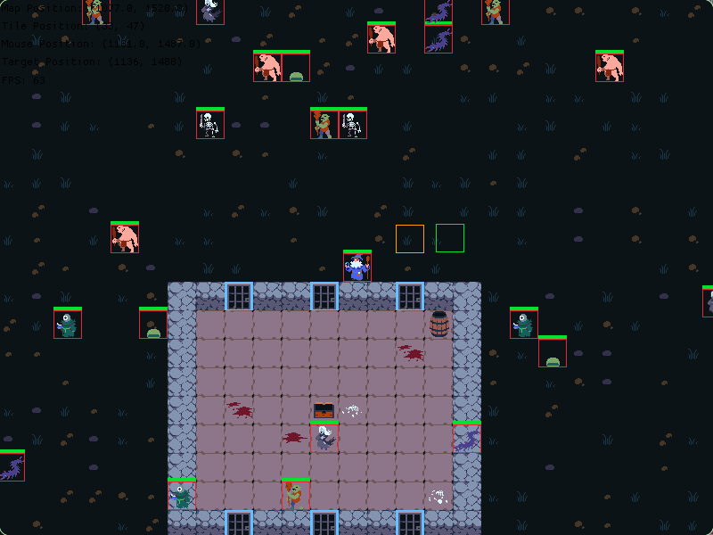

    <h1>Dyrah</h1>
    
A retro-style MORPG inspired by the unforgiving nostalgia of old-school <a href="https://tibia.com">Tibia</a>

---  
  
As players venture deeper into mysterious caves, forests and towering ruins of Dyrah, they’ll encounter a variety of increasingly challenging enemies. Navigating through dark passages that may lead to hidden treasures or deadly traps, each area is a test of skill, strategy, and sometimes sheer luck. With mythical creatures lurking everywhere, from sneaky goblins and trolls to fearsome hydras and dragons, every adventure is a chance to prove yourself
  
The world is unforgiving—dying means losing character progression, valuable items, and facing other harsh penalties, making each decision critical. Players must weigh risks carefully, balancing the desire for exploration against the looming threat of permanent loss

## Getting Started
### Compiling From Source
**Download Dyrah**  
`git clone https://github.com/opensource-force/dyrah; cd dyrah`

**Compiling/executing the server**  
`cargo run -rp dyrah_server`

**Compiling/executing the client**  
`cargo run -rp dyrah_client`

## Features & Development
Dyrah is in early stages of development, so expect bugs and missing features

### Core Systems
- [x] Multiplayer server-client
- [x] Entity management (ECS)
- [x] Input handling
- [x] Camera system
- [ ] Tilemap rendering
- [ ] Collision detection
- [ ] Pathfinding
- [ ] Combat system
- [ ] NPC / AI
- [ ] Dialogue / interaction
- [ ] Quest system

### Gameplay Mechanics
- [ ] Loot system
- [ ] Character progression
- [ ] Inventory management
- [ ] Chat
- [ ] Questing system
- [ ] Parties / guilds
- [ ] Economy / trading
- [ ] Crafting
- [ ] Housing
- [ ] Events / raids
- [ ] Achievements / leaderboard
  
## Resources
### Recommended Tools
Map files are created with the [Tiled](https://www.mapeditor.org/) map editor, in which the capability to export as a JSON file is provided. This JSON information is utilized to render a tileset, which can be created with a pixel art editor like [Aseprite](https://www.aseprite.org/)

### Docs
- [Egor](https://docs.rs/egor/latest/egor/)
- [Secs](https://docs.rs/secs/latest/secs/)
- [Wrym](https://docs.rs/wrym/latest/wrym/)

### Guides
- [Tiled](https://not-fl3.github.io/platformer-book/tiled/index.html)
- [MDN Game Development](https://developer.mozilla.org/en-US/docs/Games)

### Examples
- [Egor](https://github.com/wick3dr0se/egor/tree/main/demos)
- [Wrym](https://github.com/wick3dr0se/wrym/tree/main/examples)
- [Secs](https://github.com/wick3dr0se/secs/tree/main/examples)
- [SDL2](https://github.com/wick3dr0se/sdl-game/) (reference)

## Contributing
Fork the repository, push changes to a new branch (e.g. USERNAME/FEATURE) and submit a pull request. There is always something to improve upon or implement. Any contributions are greatly appreciated!

Dyrah is actively discussed in the [Open Source Force Discord](https://opensourceforce.net/discord) community. Join us and check out the Dyrah thread in the showcase forum for easier engagement

## Credits
Built with ❤️ by Open Source Force

Thanks to the Open Tibia community and the awesome sprite packs used in prototyping Dyrah's development